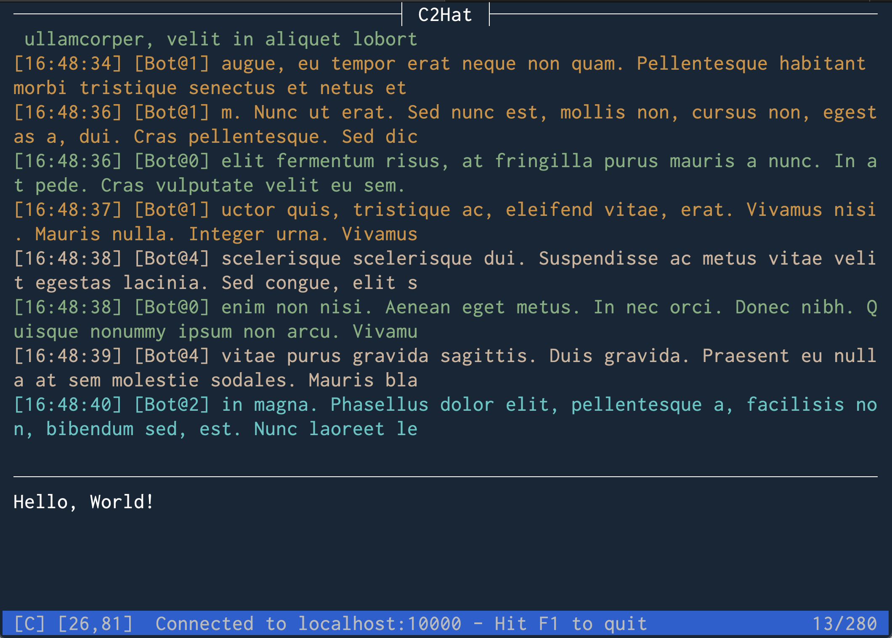

# C2Hat Client Commands

The command line client for C2Hat is based on [ncurses](https://invisible-island.net/ncurses/) and it's interface is similar to Vim, but it's a lot simpler.

## User Interface



The main application view consists of a ChatLog window on top, an Input window below, and a Status bar at the bottom.

### Chat Log

The ChatLog window can have two different display modes: Chat mode, and Browse mode.

When Chat mode is active, the window will display the live updates from all chat users, using the format

```
[HH:MM:SS] [UserName] Message content
```

When Browse mode is active, the ChatLog window will display the current page of the chat log buffer, and users can navigate through the other pages using the `PageUp`/`PageDown` keys.

The default display mode is Chat.

To switch from Chat mode to Browse mode use the `PageUp` key. The status bar will show a `B` indicator on the bottom left.

To go back to Chat mode use the `ESC` key. The status bar will show a `C` indicator on the bottom left.

### Input

The Input window is where users enter the messages to be sent. Hitting `ENTER` will send the message, while hitting `ESC` will reset the content of the window.

A counter on the status bar (bottom right) will tell you how many characters are left.

### Status Bar

The status bar displays 4 main pieces of information, from left to right:

 - the ChatLog current display mode: `[C]` or `[B]`
 - the Terminal size: `[lines,columns]`
 - the current status message
 - the Input box counter: `current/max`

In the screenshot above we have the ChatLog in Chat mode on a terminal with 26 lines and 81 columns. We have entered 13 characters out of a maximum of 280.

## Keyboard Commands Cheat Sheet

 - `F1` or `CTRL+C`: disconnect and quit the client
 - `Page Up`
    - switch from Chat to Browse mode
    - if already in Browse mode, display the previous log page
 - `Page Down`: displays the next log page (Browse mode only)
 - `ESC`
    - when in Chat mode: reset the content of the Input window
    - when in Browse mode: switch back to Chat mode
 - `ENTER`: send the content of the Input window as a new message or command (if not empty)
 - Any other non-control character (including emojis): update the content of the Input window
 - Arrow keys: move the cursor around the Input window, if there is content to edit
 - `BACKSPACE`: delete the character to the left of the cursor

## Logging and Debugging

The C2hat client will log its activity and errors to a file located at `~/.local/state/c2hat/client.log`.

The default log level is `INFO`. By using the `--debug` option, the log level is switched to `DEBUG` and more verbose and detailed messages will be written to the log file.
